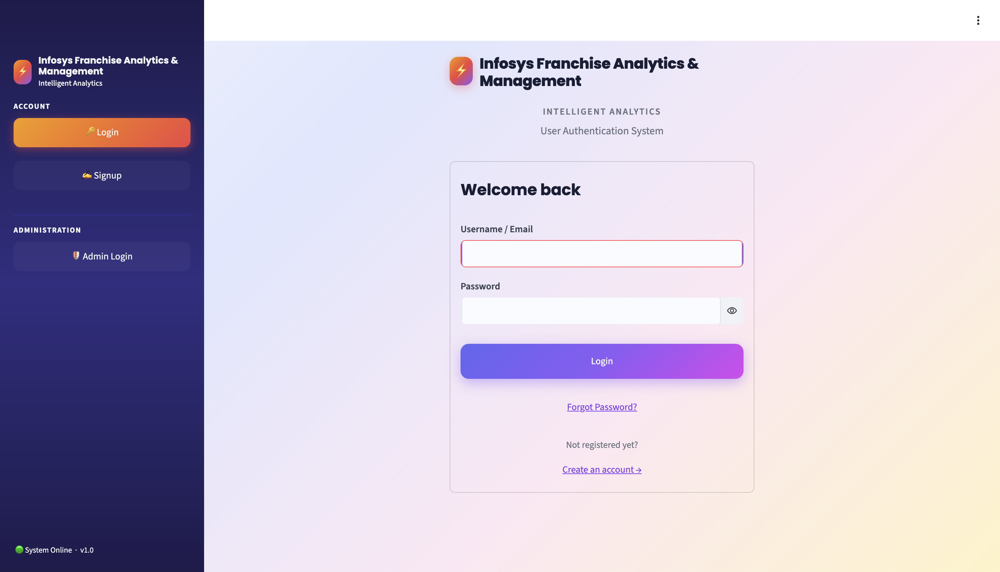
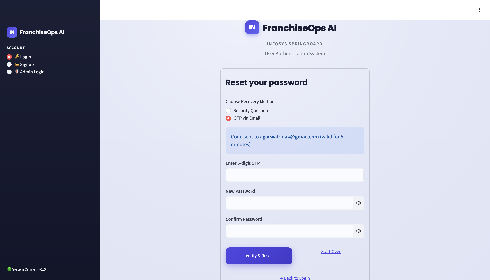
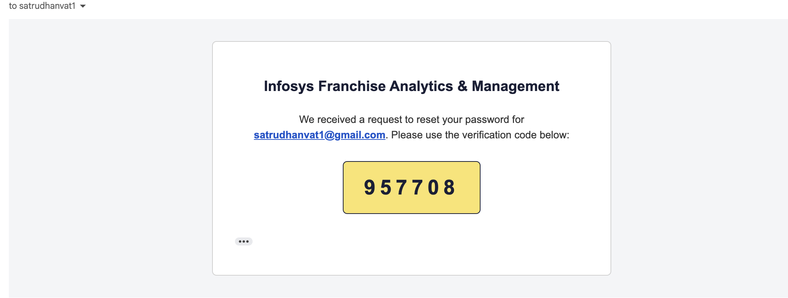
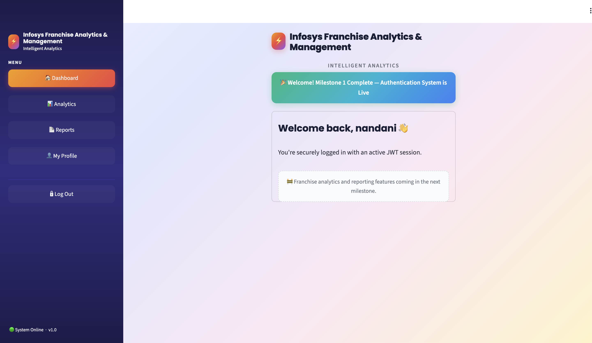

# Milestone 1 — User Authentication Module

**Infosys Springboard Internship 7.0 · Batch 1**

---

## 📸 Screenshots

| Page | Screenshot |
|---|---|
| Login Page |  |
| Forgot Password|  |
| OTP via Email|  |
| User Dashboard |  |

---

## 📌 What This Milestone Covers

Milestone 1 is the authentication layer for **FranchiseOps AI** — a secure Streamlit app with:

- **Login** — username/email + password, JWT session token issued on success
- **Signup** — mandatory field validation, unique username enforcement, security question set for recovery
- **Forgot Password** — two recovery routes: Security Question, and OTP via Email
- **User Dashboard** — post-login area with its own nav (Home, My Profile)
- **Admin Dashboard** — separate hardcoded admin login, lists all registered users (never passwords)

---

## 🛠️ How I Built This

I started from the milestone brief (Login, Signup, Forgot Password, JWT sessions, Admin Dashboard, all running in Colab via ngrok) and built it in stages rather than all at once, fixing real issues as they came up along the way:

**1. First working version.** I wrote a single `app.py` covering all three auth pages plus a stub Admin page, wired up JWT for session tokens, and got it running in Colab with `pyngrok` for a public URL. Users were stored in a local `users.json` file.

**2. Caught a security issue before it went further.** While testing, I realized my Gmail address and app password were hardcoded directly in the code — and about to be pushed to a public GitHub repo. I revoked that app password immediately, generated a new one, and moved every secret (`JWT_SECRET`, `EMAIL_ADDRESS`, `EMAIL_PASSWORD`, `ADMIN_USERNAME`, `ADMIN_PASSWORD`, `NGROK_AUTHTOKEN`) into **Google Colab Secrets**, read into the app via environment variables at runtime. `users.json` was gitignored so test account data never gets committed either.

**3. Hashed passwords properly.** The first version compared plaintext passwords directly. I switched to **bcrypt** for hashing on signup and verification on login/reset, so raw passwords are never stored anywhere.

**4. Made the JWT check actually mean something.** Originally the Dashboard only checked *if a token existed* in session state — not whether it was still valid. I fixed it to properly decode and verify the JWT (signature + expiry) before showing any protected page, and handle expired/invalid tokens gracefully by bouncing back to Login.

**5. Rebuilt the OTP flow to be genuinely secure.** My first pass stored the OTP as a raw string in session state with no expiry — functional, but weak. Based on a review of a more security-conscious reference implementation, I rebuilt it so the OTP is **hashed with bcrypt and embedded inside a signed JWT with a 5-minute expiry**. The email itself is only ever compared against the hash, and an expired code fails automatically via `jwt.ExpiredSignatureError` — no manual timestamp bookkeeping needed.

**6. Fixed the flow gaps.** Originally Signup and Forgot Password left the user sitting on the same page after success. I added redirects back to Login, moved Forgot Password *inside* the Login page (matching how most real apps structure it) instead of being a separate top-level menu item, and built out the Admin Dashboard properly — hardcoded admin credentials (from Colab Secrets, not code) that unlock a table of all registered users.

**7. UI pass.** The first UI used a CSS trick (`<div>` markdown wrappers) to try to build "cards" — which left broken empty boxes because Streamlit doesn't actually let widgets render inside markdown HTML. Switched to Streamlit's native `st.container(border=True)`, which fixed the layout properly. Iterated on button sizing (`use_container_width=True` + `type="primary"`/`"secondary"` for real button theming instead of fragile CSS selectors), added a branded header, a grouped sidebar nav with icons, and a "Not registered? Sign up" / "Already have an account?" cross-link between Login and Signup — small touches that make it feel like a finished product rather than a bare debug UI.

**8. Post-login dashboard.** Added an actual sidebar menu inside the Dashboard (Home / My Profile / Logout) instead of a dead-end welcome message — Home shows a "Milestone 1 Complete" banner and a note about upcoming franchise-management features, My Profile shows the logged-in user's own account details pulled live from `users.json`.

**9. Notebook cleanup.** The working notebook went through a lot of trial-and-error (`pkill`/`nohup`/repeated installs while debugging). Final version is a clean 6-cell sequence: install → write `app.py` → load secrets → launch Streamlit → check logs → start ngrok.

---

## 🛠️ Tech Stack

| Component | Technology |
|---|---|
| UI / Frontend | Streamlit |
| Session Auth | PyJWT (HS256, 1-hour expiry) |
| Password Hashing | bcrypt |
| OTP Delivery | Gmail SMTP (`smtplib`) |
| OTP Security | Hashed OTP embedded in a signed, time-limited JWT (5-min expiry) |
| Public Tunneling | ngrok (via `pyngrok`) |
| Data Store | `users.json` (local, gitignored — not committed) |
| Secrets Management | Google Colab Secrets (`userdata`) |
| Runtime | Google Colab |

---

## 🔐 Security Notes

- All passwords are hashed with **bcrypt** before storage — never stored or compared in plaintext.
- All secrets are loaded from **Google Colab Secrets** at runtime via environment variables — nothing sensitive is hardcoded in `app.py` or the notebook.
- OTPs are never stored raw. Each OTP is hashed and embedded inside a signed JWT with a 5-minute expiry, so a leaked or intercepted token can't be reused indefinitely or tampered with.
- Login sessions are validated by decoding and verifying the JWT signature and expiry on every page load — not just checking that a token is present.
- `users.json` is excluded from version control via `.gitignore` and is recreated fresh each Colab session.

---

## 🚀 How to Run

1. Open `Milestone1_Final.ipynb` in **Google Colab**.
2. Add the following secrets under **🔑 Secrets** (left sidebar), and toggle **Notebook access ON** for each:

   | Secret Name | Description |
   |---|---|
   | `JWT_SECRET` | Any long random string used to sign session/OTP tokens |
   | `EMAIL_ADDRESS` | Gmail address used to send OTP emails |
   | `EMAIL_PASSWORD` | Gmail App Password (not your regular Gmail password) |
   | `ADMIN_USERNAME` | Username for the Admin Dashboard |
   | `ADMIN_PASSWORD` | Password for the Admin Dashboard |
   | `NGROK_AUTHTOKEN` | Your ngrok authtoken (from ngrok dashboard) |

3. Run all cells top to bottom:
   - Installs dependencies
   - Writes `app.py`
   - Loads secrets into the environment
   - Launches Streamlit
   - Starts an ngrok tunnel and prints the public URL

4. Open the printed ngrok URL in your browser to use the app.

---

## 📂 Project Structure

```
Milestone1/
├── Milestone1_Final.ipynb   # Colab notebook (setup + launch)
├── app.py                   # Streamlit application
├── requirements.txt         # Python dependencies
├── README.md                # This file
└── screenshots/             # App screenshots (forgot_otp.png, dashboard.png)
```

---

## ✅ Milestone 1 Checklist

- [x] Login, Signup, Forgot Password (both recovery routes) working
- [x] JWT used for session handling, verified on every dashboard load
- [x] Passwords hashed with bcrypt
- [x] OTP hashed and time-limited via signed JWT
- [x] User Dashboard and Admin Dashboard both functional
- [x] All secrets loaded via Colab Secrets — none hardcoded
- [x] Mandatory-field, email, and password validation implemented
- [x] Screenshots captured and linked above
