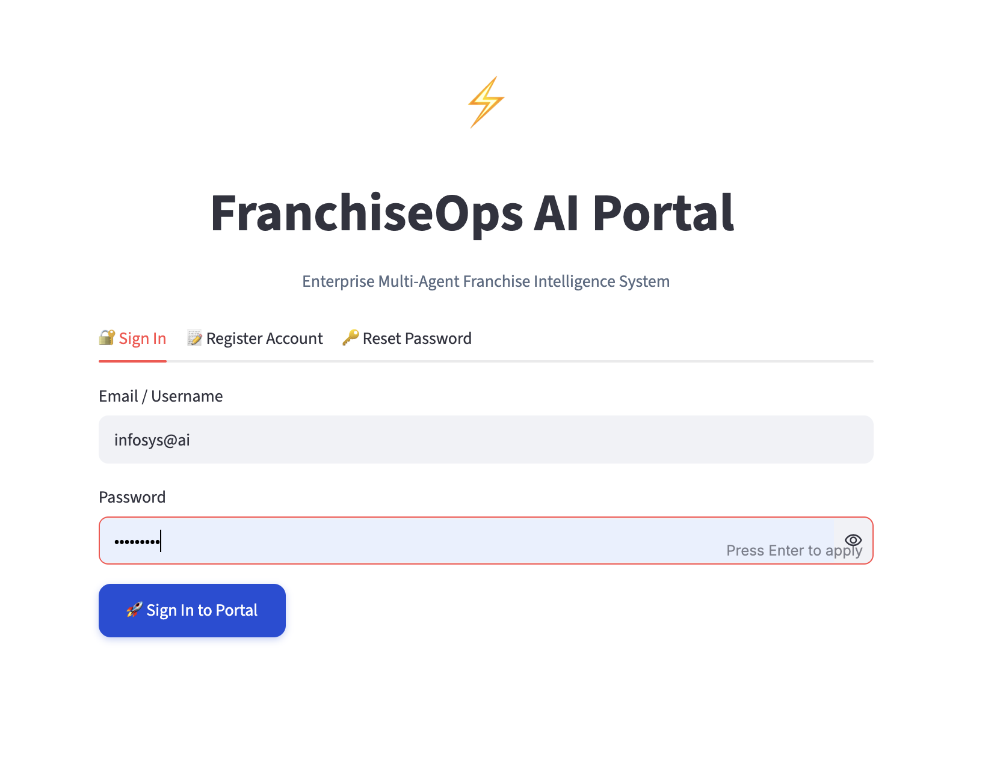
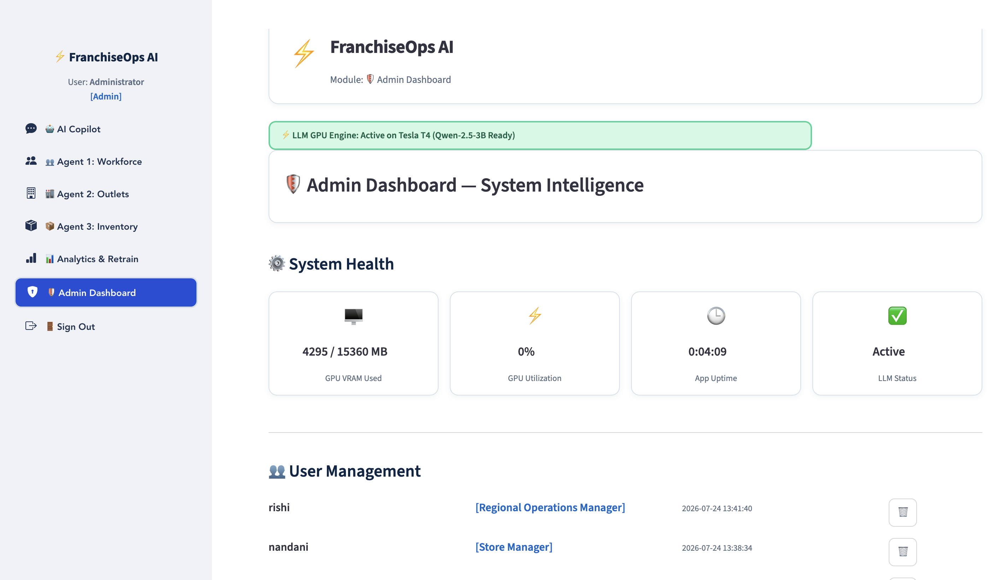
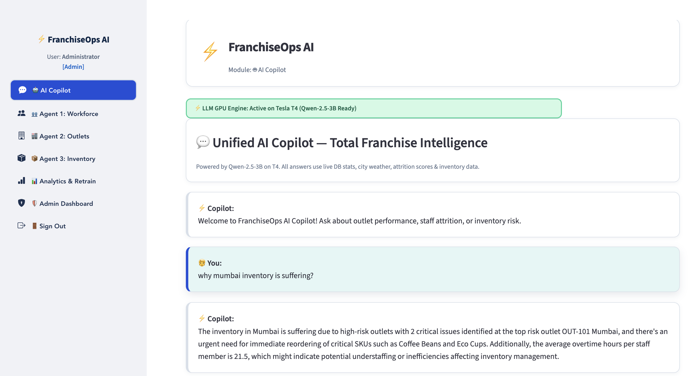

# ⚡ FranchiseOps AI — Milestone 2

**Enterprise Multi-Agent Franchise Operations Platform**

A Streamlit web app (run from a Google Colab notebook) that helps a multi-outlet franchise business monitor workforce attrition, outlet performance/territory clustering, and inventory/supply-chain risk — with an on-device LLM (Qwen-2.5-3B-Instruct) acting as an AI copilot that explains and debates the ML agents' findings in natural language.

---

## What it does

The platform is built around three ML "agents" plus an LLM orchestration layer:

| Agent | Purpose | Models used |
|---|---|---|
| **Agent 1 — Workforce** | Predicts staff attrition risk per employee | Calibrated Logistic Regression / RF / GB / SVM (best ROC-AUC auto-selected) |
| **Agent 2 — Outlets** | Clusters outlets into performance tiers (Excellent / Good / Needs Attention / Critical) and forecasts revenue | KMeans (k=3–5, silhouette-selected) + RF/GradientBoosting/ExtraTrees regressor |
| **Agent 3 — Inventory** | Predicts stockout risk and demand per SKU per outlet | RF / GradientBoosting / ExtraTrees / Ridge (best R² auto-selected) |

On top of these, `llm_engine.py` uses a locally-hosted **Qwen-2.5-3B-Instruct** (4-bit NF4 quantized) to:
- Orchestrate a 3-agent "debate" and synthesize a combined recommendation
- Answer natural-language questions about outlets, staff, and inventory in the **AI Copilot** tab

Extra context layers feed the agents realistic, simulated signal:
- **`weather_context.py`** — simulated weather/demand-impact/supply-delay data for major Indian (and a few global) cities
- **`notifications.py`** — simulated multi-channel (SMS/Email/In-App) alert log stored in SQLite
- **`admin_dash.py`** — GPU/system health, uptime, and alert monitoring for admins

## App structure (Streamlit tabs)

- 🤖 **AI Copilot** — chat with the LLM across all agent data
- 👥 **Agent 1: Workforce** — attrition risk dashboard
- 🏬 **Agent 2: Outlets** — territory clustering, weather-linked demand charts
- 📦 **Agent 3: Inventory** — SKU criticality heatmap, reorder priority queue
- 📊 **Analytics & Retrain** — model metrics, retraining trigger
- 🛡️ **Admin Dashboard** *(admin role only)* — system health, notification log
- 🚪 Sign Out

Authentication (`auth.py`) supports login, signup, and a forgot-password flow with **email OTP verification** sent via Gmail SMTP.

## Tech stack

- **Frontend:** Streamlit + `streamlit-option-menu`, custom corporate blue/navy theme (`ui_theme.py`)
- **LLM:** Qwen-2.5-3B-Instruct, 4-bit NF4 quantized via `bitsandbytes`, served through `transformers`
- **ML:** scikit-learn (classification, regression, clustering), models persisted with `joblib`
- **Data:** SQLite (`db.py`) — outlets, staff, inventory, chat history, notifications
- **Auth:** `bcrypt` password hashing, `PyJWT` session tokens, Gmail SMTP for OTP email
- **Hosting:** Runs inside Google Colab; exposed publicly via `pyngrok`
- **Charts:** Plotly Express

## Requirements

- Google Colab with a **GPU runtime** (T4 or better recommended for 4-bit inference)
- A Google account (for Google Drive persistent storage / model caching)
- The following secrets configured in **Colab Secrets** (🔑 icon in the left sidebar):

| Secret | Required | Purpose |
|---|---|---|
| `HF_TOKEN` | Yes | Download Qwen-2.5-3B-Instruct from Hugging Face |
| `NGROK_AUTHTOKEN` | Yes | Expose the Streamlit app via a public URL |
| `EMAIL_ID` / `EMAIL_PASSWORD` | For OTP login | Gmail address + a 16-character **App Password** (not your regular Gmail password) |
| `JWT_SECRET_KEY` | Optional | Session token signing (falls back to a dev default if unset) |
| `ADMIN_EMAIL_ID` / `ADMIN_PASSWORD` | Optional | Default admin login (falls back to `infosys@ai` / `admin@123`) |
| `KAGGLE_USERNAME` / `KAGGLE_KEY` | Optional | If any training data is pulled from Kaggle |

## How to run

Run the notebook cells **top to bottom, in order**:

1. **Step 1 — Install Dependencies** — installs Streamlit, ngrok, ML/LLM libraries
2. **Step 2 — Configure Secrets & Mount Drive** — loads secrets, mounts Google Drive for persistent model/database storage
3. **Step 3 — Verify GPU & Load Qwen-2.5-3B** — confirms GPU availability, loads the 4-bit quantized LLM
4. **Step 4 — Write All Application Modules** — writes `llm_engine.py`, `config.py`, `ui_theme.py`, `auth.py`, `db.py`, `weather_context.py`, `notifications.py`, `seed_data.py`, `admin_dash.py`, `agent2_franchise.py`, `agent3_franchise.py` to disk
5. **Step 5 — Initialise Database & Seed Sample Data** — creates SQLite schema and seeds demo outlets/staff/inventory
6. **Step 6 — Train ML Agents** — trains and saves all three agents' models (`train_m2.py`)
7. **Step 6b — Write Main Application** — writes `app.py` (the Streamlit orchestrator)
8. **Step 7 — Launch Streamlit App via ngrok** — starts the app as a background process and prints a public URL
9. **Step 8 — Stop Application & Free GPU Memory** — kills the Streamlit process and frees VRAM when you're done

Open the printed ngrok URL, sign up or log in (with OTP email verification), and use the sidebar to navigate between agents.

## ⚠️ Important operational notes

- **The Streamlit app runs as a separate OS process** (`subprocess.Popen`), spawned from the notebook's environment. If you change any secret (e.g. `EMAIL_PASSWORD`), you must **re-run Step 2 first**, then **kill the old process** (`!pkill -9 -f streamlit`) **before** re-running Step 7 — otherwise the running app won't pick up the new value.
- **Gmail OTP requires an App Password**, not your normal Gmail password — generate one under Google Account → Security → App Passwords (requires 2FA enabled on the account).
- If `EMAIL_ID`/`EMAIL_PASSWORD` are not set, the app falls back to printing the OTP directly on screen instead of emailing it (useful for local testing, not for production).
- Google Drive storage (`/content/drive/MyDrive/FranchiseOps_AI`) persists the database and trained models across Colab sessions — re-running Step 5/6 will not lose prior data unless you delete that folder.

## Project structure (generated files)

```
config.py            # secrets, paths, model file locations
ui_theme.py           # shared corporate blue/navy Streamlit theme
auth.py               # login / signup / OTP password reset
db.py                 # SQLite schema + connection helpers
weather_context.py     # simulated city weather → demand/supply impact
notifications.py       # simulated SMS/Email/In-App alert log
seed_data.py           # demo outlets, staff, inventory seed data
train_m2.py            # trains & saves all 3 agents' ML models
llm_engine.py           # Qwen-2.5-3B loading + multi-agent orchestration
agent2_franchise.py     # Agent 2 (outlets) Streamlit tab
agent3_franchise.py     # Agent 3 (inventory) Streamlit tab
admin_dash.py           # Admin dashboard tab
app.py                  # Main Streamlit app / page router
```

## Demo Screenshots

> Screenshots are stored in the [`screenshots/`](./screenshots) folder.

### 1. Login Page


### 2. Admin Dashboard


### 3. AI Copilot


### 4. Agent Tab (Workforce / Outlets / Inventory)


## Roadmap / known limitations

- Weather data is simulated, not pulled from a live weather API
- Notifications (SMS/Email) are logged to SQLite but not actually dispatched except for OTP emails
- Single SQLite file — fine for demo/pilot scale, would need a proper DB for multi-user production use
