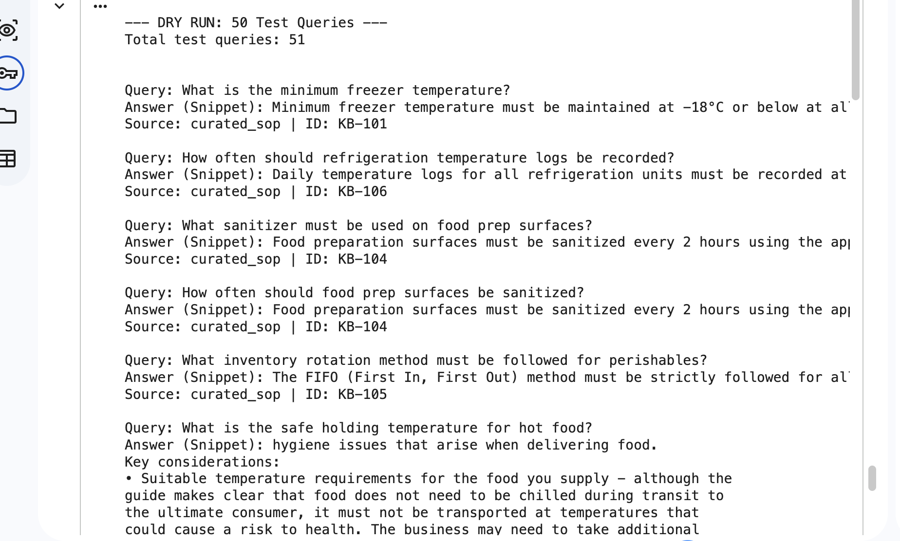

# Milestone 3 — RAG Knowledge Base & Consolidated Platform

**Infosys Springboard Internship 7.0 · Batch 1 · Team Submission**

---

## 📌 What This Milestone Adds

Milestone 3 has two deliverables:

1. **Consolidated Notebook** — Milestone 1 (Authentication) and Milestone 2 (ML Agents, LLM Copilot, Admin Dashboard) combined into a single working notebook. Milestone 2's SQLite-based authentication (with progressive lockout, OTP via email, and password strength checking) supersedes Milestone 1's original flat-file auth, since it implements the same Login / Signup / Forgot Password flows on a more robust backend.

2. **RAG Knowledge Base** — a separate, standalone notebook dedicated to building a Retrieval-Augmented Generation pipeline over franchise operations documentation: food safety regulations, labour law, health and safety standards, and curated internal SOPs.

---

## 📂 Repository Structure

```
Milestone3/
├── FranchiseOps_AI_Milestone1_2_Combined.ipynb   # Consolidated M1 + M2 notebook
├── FranchiseOps_RAG_Builder.ipynb                # Standalone RAG pipeline notebook
├── README.md                                     # This file
└── screenshots/
```

---

## 🧠 RAG Pipeline Overview

The RAG builder notebook runs in three phases:

**Phase 1 — Source Collection**
Scrapes a static list of HTML pages and PDFs covering food safety (FSSAI, WHO, FAO), labour and workplace safety regulation (ILO, OSHA), and franchise operations guidance.

**Phase 2 — Auto-Discovery**
Parses the collected HTML pages for additional embedded PDF links, expanding the source set significantly beyond the original static list.

**Phase 3 — Download & Extraction**
Downloads and extracts text from every discovered PDF using PyMuPDF, alongside 25+ curated internal SOP documents covering food safety, staffing, compliance, customer service, finance, and store procedures.

**Chunking & Embedding**
Extracted text is split with `RecursiveCharacterTextSplitter` (1000 characters, 100 overlap), embedded using `all-MiniLM-L6-v2`, and indexed into a FAISS vectorstore for similarity search.

---

## 📊 Knowledge Base Size

| Source Type | Count |
|---|---|
| Static PDF list | 88 |
| Auto-discovered PDFs | 424 |
| Curated SOP documents | 25+ |
| **Total unique PDFs processed** | **511** |

---

## ✅ Testing — 50 Query Validation

The RAG system was validated against 50 distinct test queries spanning food safety, hygiene, staffing, regulatory compliance, customer service, finance, equipment maintenance, store procedures, and broader domain knowledge (labour law, OSHA, WHO, ILO, FAO) — well beyond the 30-query minimum requirement.

Each query returns the top matching document chunk along with its source and document ID, confirming the vectorstore retrieves relevant, correctly-attributed content across the full breadth of the knowledge base.

**Sample query/answer output:**

> _[Screenshot placeholder — paste the query/answer display output here]_
>
> 

---

## 🛠️ Tech Stack

| Component | Technology |
|---|---|
| Document Scraping | `requests`, `BeautifulSoup4` |
| PDF Extraction | PyMuPDF (`fitz`) |
| Text Chunking | LangChain `RecursiveCharacterTextSplitter` |
| Embeddings | `all-MiniLM-L6-v2` (Sentence Transformers) |
| Vector Store | FAISS |
| Sentiment/Text Analysis | TextBlob, VADER |
| Runtime | Google Colab |
| Storage | Google Drive (persistent) |

---

## 🚀 How to Run

**Combined M1+M2 notebook:**
1. Open `FranchiseOps_AI_Milestone1_2_Combined.ipynb` in Google Colab
2. Set the 7 required Colab Secrets (`JWT_SECRET_KEY`, `ADMIN_EMAIL_ID`, `ADMIN_PASSWORD`, `NGROK_AUTHTOKEN`, `HF_TOKEN`, `EMAIL_ID`, `EMAIL_PASSWORD`)
3. Switch runtime to T4 GPU
4. Run all cells top to bottom

**RAG builder notebook:**
1. Open `FranchiseOps_RAG_Builder.ipynb` in Google Colab
2. Mount Google Drive when prompted
3. Run all cells top to bottom — Phase 3 (PDF download/extraction) takes the longest given the volume of documents
4. The final cell runs the 50-query validation and prints results
---

## ✅ Milestone 3 Checklist

- [x] Milestone 1 + 2 combined into a single working notebook
- [x] Separate RAG pipeline notebook
- [x] Knowledge base expanded to 511 unique PDFs (from ~90 originally)
- [x] 50 test queries validated (exceeds 30+ requirement)
- [ ] Screenshots captured and linked in README
