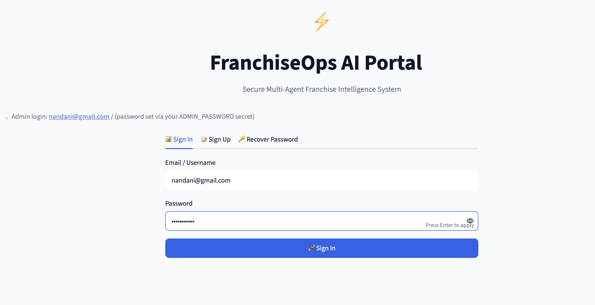
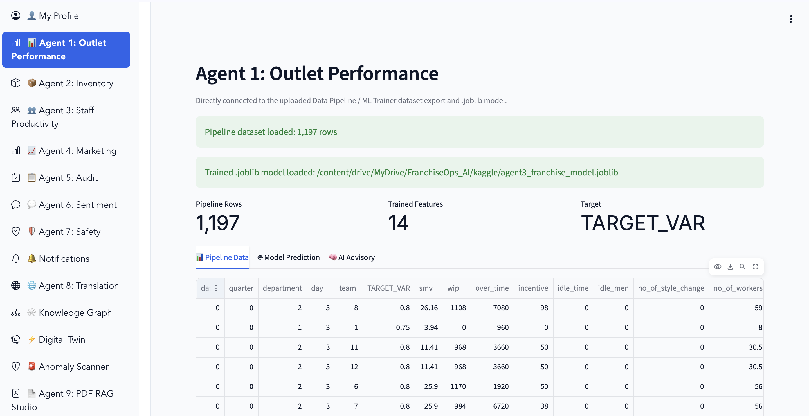
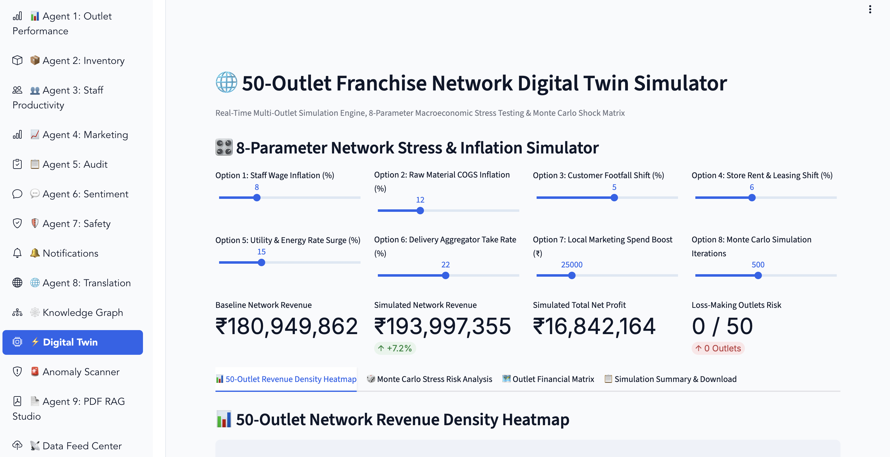
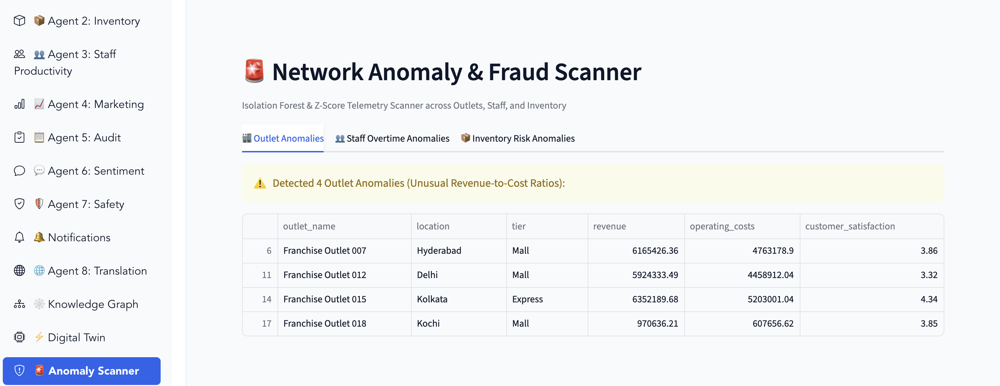
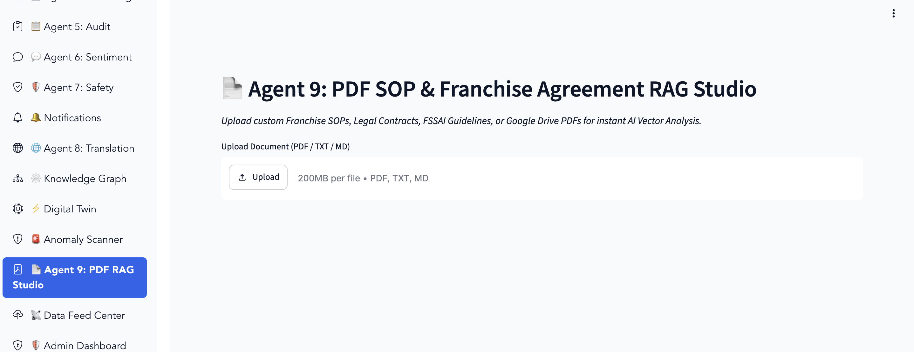

# FranchiseOps AI — Agentic AI for Franchise Management System with Performance Monitoring Assistance


FranchiseOps AI is an enterprise multi-agent platform that helps franchise networks monitor outlet performance, inventory, staff productivity, marketing ROI, customer sentiment, and regulatory compliance — all through a single Streamlit application backed by a grounded, multilingual AI Copilot.

This milestone integrates three previously separate components into one working execution pipeline:

```
RAG Engine  →  Kaggle DataPipeline / ML Trainer  →  Overall FranchiseOps AI Application
```

---

## 📌 Table of Contents

1. [Architecture Overview](#architecture-overview)
2. [Execution Sequence](#execution-sequence)
3. [Environment & Secrets Setup](#environment--secrets-setup)
4. [1. RAG Engine](#1-rag-engine)
5. [2. Kaggle DataPipeline / ML Trainer](#2-kaggle-datapipeline--ml-trainer)
6. [3. Overall Application](#3-overall-application)
7. [Authentication & User Management](#authentication--user-management)
8. [AI Copilot](#ai-copilot)
9. [The 9 Franchise Agents](#the-9-franchise-agents)
10. [Admin Dashboard](#admin-dashboard)
11. [Known Limitations](#known-limitations)
12. [Screenshots](#screenshots)

---

## Architecture Overview

| Layer | Technology |
|---|---|
| Frontend | Streamlit (multi-page, tabbed UI) |
| Backend LLM | Qwen2.5-Coder-1.5B-Instruct (Hugging Face, GPU-accelerated) |
| Retrieval (RAG) | Keyword-grounded retrieval over a curated + scraped knowledge base (FAISS index also built, JSON KB is what the app actually consumes) |
| ML Models | scikit-learn models (Random Forest, Gradient Boosting, Neural Nets, Isolation Forest, etc.) trained on real Kaggle datasets |
| Database | SQLite, stored in Google Drive so it persists across Colab sessions |
| Auth | bcrypt password hashing + JWT sessions + OTP-based password recovery |
| Deployment | Cloudflare Tunnel (public HTTPS URL from Colab) |
| Translation | Facebook NLLB-200-distilled-600M (offline, 20 languages) |

All persistent data (database, RAG knowledge base, trained models) lives under one Google Drive folder:

```
MyDrive/FranchiseOps_AI/
├── franchise_database.db
├── rag_knowledge_base.json
├── faiss_index/
├── bm25_index/
└── kaggle/
    ├── agent1_franchise_model.joblib
    ├── agent2_franchise_model.joblib
    ├── agent3_franchise_model.joblib
    ├── agent4_marketing_model.joblib
    ├── agent5_audit_model.joblib
    ├── agent6_sentiment_model.joblib
    ├── agent7_safety_model.joblib
    └── pipeline_exports/
        ├── agent1_outlet_performance.csv
        ├── agent2_inventory.csv
        ├── agent3_staff_productivity.csv
        ├── agent4_marketing.csv
        ├── agent5_audit.csv
        ├── agent6_sentiment.csv
        └── agent7_safety.csv
```

This shared Drive folder is what actually connects the three notebooks — each one reads from and writes to it, so results from an earlier notebook automatically become available to the next.

---

## Execution Sequence

⚠️ **Mandatory order** — do not run the Overall Application before the first two steps complete successfully, since it depends on their output.

| Step | Notebook | What it produces |
|---|---|---|
| 1 | `RAG_Builder.ipynb` | Scrapes/curates SOP & compliance knowledge → saves `rag_knowledge_base.json` + FAISS index to Drive |
| 2 | `FranchiseOps_Data_Pipeline_ML_Trainer.ipynb` | Downloads real Kaggle datasets per agent, trains multiple ML models per target, saves the best model (`.joblib`) + exported CSVs to Drive |
| 3 | `FranchiseOps_AI_Milestone4_Final.ipynb` | Boots the full Streamlit application, reading everything produced in Steps 1–2 |

All three notebooks must mount the **same Google Drive account** — otherwise the Overall Application will fall back to its built-in defaults instead of your real data.

---

## Environment & Secrets Setup

The application reads all sensitive configuration from **Google Colab Secrets** (🔑 icon in the left sidebar). Set the following, and make sure "Notebook access" is toggled **on** for each one, in each notebook that needs it:

| Secret Name | Used For |
|---|---|
| `HF_TOKEN` | Hugging Face access for the Qwen LLM |
| `JWT_SECRET_KEY` | Signing session tokens & OTP tokens |
| `EMAIL_ID` / `EMAIL_PASSWORD` | Sending OTP emails for password recovery (Gmail **App Password** required, not your normal password) |
| `ADMIN_EMAIL_ID` / `ADMIN_PASSWORD` | Bootstraps the default Administrator account on first run |
| `NGROK_AUTHTOKEN` | Optional fallback tunnel (Cloudflare Tunnel is the primary method used) |
| `KAGGLE_USERNAME` / `KAGGLE_KEY` (or the newer Kaggle access token) | Authenticating Kaggle dataset downloads inside the DataPipeline notebook |

> Because the app itself runs as a separate subprocess (`streamlit run app.py`), the final launch cell explicitly copies these secrets from the notebook kernel into that subprocess's environment before starting it — this is required for Colab Secrets to reach the running app at all.

---

## 1. RAG Engine

`RAG_Builder.ipynb` scrapes and curates domain knowledge — FSSAI food safety guidance, labour compliance, SOPs, and other franchise-relevant reference material — and produces:
- A JSON knowledge base (`rag_knowledge_base.json`) that the app's `rag_engine.py` loads directly into its retrieval index at startup
- A FAISS vector index (kept for reference / future use)

At runtime, the AI Copilot and every agent's "AI Advisory" tab query this knowledge base via keyword-grounded retrieval — prioritizing verified RAG content over the LLM's own generated text, and explicitly saying so when no matching evidence is found (per the "must not hallucinate" requirement).

---

## 2. Kaggle DataPipeline / ML Trainer

`FranchiseOps_Data_Pipeline_ML_Trainer.ipynb` downloads real datasets from Kaggle for 7 target areas, tries several candidate datasets per target with automatic fallback, and (only if no real dataset is found) generates a synthetic fallback so training can still proceed. It trains multiple candidate models per target (Random Forest, Gradient Boosting, Linear/Ridge/Lasso Regression, SVR/SVC, Decision Tree, MLP Neural Network, K-Means, Isolation Forest) and saves the **best-performing** model as a `.joblib` file, plus exports the merged dataset as CSV for the app to reuse.

| Target | Saved Model | Feeds App Page |
|---|---|---|
| Sales | `agent1_franchise_model.joblib` | Outlet Performance |
| Stockout | `agent2_franchise_model.joblib` | Inventory Optimization |
| Productivity | `agent3_franchise_model.joblib` | Staff Productivity |
| Conversion | `agent4_marketing_model.joblib` | Marketing Intelligence |
| Risk | `agent5_audit_model.joblib` | Audit Engine |
| Sentiment | `agent6_sentiment_model.joblib` | Customer Sentiment |
| Score | `agent7_safety_model.joblib` | Compliance & Safety |

---

## 3. Overall Application

`FranchiseOps_AI_Milestone4_Final.ipynb` writes out the complete `franchise_app/` codebase, installs dependencies, seeds the SQLite database, boots the FastAPI microservice backing the LLM, and launches the Streamlit UI behind a public Cloudflare Tunnel URL — the single link used for the entire demo.

Each agent page connects to its trained model through `pipeline_bridge.py`, which:
- Loads the correct `.joblib` file for that page
- Dynamically reads the model's `feature_names_in_` to align columns automatically (rather than assuming a fixed schema)
- Falls back gracefully with a clear on-screen status message if a model or dataset isn't found yet, instead of crashing

---

## Authentication & User Management

- **Sign Up** — username, email, password (strength-checked), role selection, and a security question/answer (used later for account recovery)
- **Sign In** — email/username + password, bcrypt-verified, JWT session issued on success
- **Progressive lockout** — 3 failed attempts → 5 minute lock, 4 → 15 minute lock, 5 → permanent lock (admin unlock required)
- **Password Recovery** — via security question, or via a 6-digit OTP emailed to the registered address (falls back to on-screen display if email isn't configured, so recovery is never fully blocked)
- **Admin bootstrap** — a default Administrator account is created automatically from the `ADMIN_EMAIL_ID` / `ADMIN_PASSWORD` secrets on first run, and re-synced on every restart

---

## AI Copilot

A multilingual, grounded chat assistant available from the main navigation:
- Responds in the user's choice of language (auto-detect available) via NLLB-200 translation
- Classifies each question's intent and, where applicable, runs a grounded query directly against the live database (text-to-SQL style) rather than guessing
- Prioritizes RAG-retrieved knowledge and verified application data; explicitly states when no evidence is available instead of fabricating an answer
- Still offers creative value — what-if scenarios, strategy suggestions, and summaries — while keeping factual claims grounded in real data

---

## The 9 Franchise Agents

| # | Agent | Focus |
|---|---|---|
| 1 | Outlet Performance | Revenue prediction, tier margin analysis, expansion simulator |
| 2 | Inventory Optimization | Stockout risk prediction, safety stock simulator |
| 3 | Staff Productivity | Attrition/productivity prediction, retention simulator |
| 4 | Marketing Intelligence | Campaign ROI prediction, CAC analysis, budget simulator |
| 5 | Audit Engine | Compliance risk prediction, FSSAI penalty simulator |
| 6 | Customer Sentiment | Real-time text sentiment analysis, NLP classification, CSAT recovery simulator |
| 7 | Compliance & Safety / Digest | Executive summary digest across the network |
| 8 | Alerts & Multilingual Translation | Real-time operational alerts; SOP translation across 20 languages via NLLB-200 |
| 9 | PDF SOP & Agreement RAG Studio | Upload and query franchise agreements / SOP PDFs directly |

Every agent includes: live metrics, visual analytics (Plotly), a trained-model prediction view, an interactive what-if simulator, and a grounded AI advisory Q&A panel.

---

## Admin Dashboard

Accessible to users with the Admin role:
- Add, delete, promote, and demote users
- Unlock permanently locked accounts
- View system-wide usage and audit activity
- Full user directory with role and account status

---

## Known Limitations

- The RAG Engine's FAISS index is built but not directly queried by the running app (the app instead uses a keyword-grounded JSON knowledge base derived from the same scraped content) — documented as a deliberate simplification, not an oversight.
- Some Kaggle dataset candidates listed in the pipeline occasionally return no matching target column and fall back to a synthetic dataset for that specific agent; this is handled automatically and logged during training.
- Colab Secrets must be explicitly forwarded into the Streamlit subprocess's environment before launch (already handled in the final launch cell) — Colab Secrets are not otherwise visible outside the notebook kernel.

---

## Screenshots












---

## Repository

GitHub: https://github.com/nandani8/Infosys_FranciseOps_AI

## Author

Nandani — Infosys Springboard Internship, FranchiseOps AI Project
